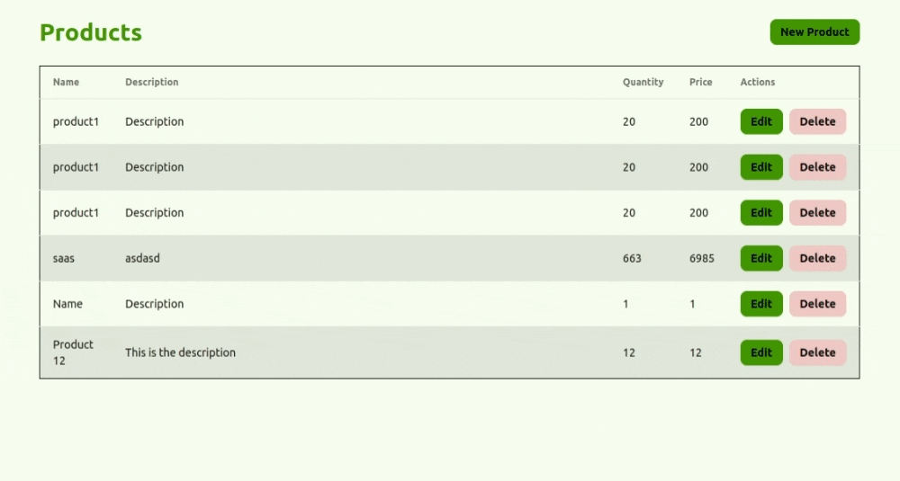

# Inventory management system

## Description

Create a very simple inventory management system that allows you to add, update and delete products.

## Backend 

Create a `CRUD` API for products using `Node.js` and `Express.js` and `MongoDB` as database.

## Frontend

Create a frontend using `React` that allows you to add, update and delete products.

1. Product List Page: 
    - Display a list of products
    - Each product should have a button to delete and update the product
    - The page should have a button to add a new product
2. Add/Edit Product Page:
    - The page should have a form to add/edit a new product
    - The page should have a link to go back to the product list page

## ScreenCapture

